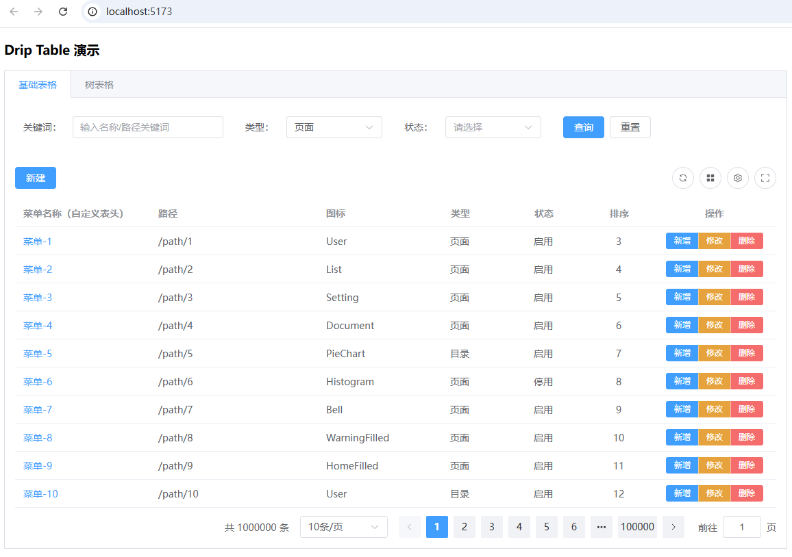
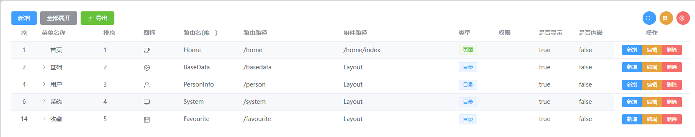

> Documentation updates may lag slightly; please refer to the demo examples. We usually publish a new version after the demos pass.

> 2025-10-25: Completed the first full optimization and added usage docs — a memorable milestone.

# 1. Installation

DripTable is a table component built on Element Plus `el-table`. It depends on Element Plus. Please install Element Plus before using DripTable.

```shell
pnpm add vue element-plus @element-plus/icons-vue @dripadmin/drip-table
```

# 2. Demos

Demo cases live under `playgrounds/drip-table-demo` in the GitHub repository.

GitHub: https://github.com/dripadmin/drip-table

- Table demo

- Tree table demo


# 3. Import and Register

Import styles in `main.ts`:

```ts
// Import styles for DripTable / DripForm
import "@dripadmin/drip-table/style.css";
```

Import components where you use the table:

```ts
import { DripTable, DripForm } from "@dripadmin/drip-table";
```

## 3.1 Basic Table Usage

Example in repo: `playgrounds/drip-table-demo/src/components/TableDemo.vue`

```vue
<DripTable
  :columns="columns"
  :data="pagedRows"
  :pagination="pagination"
  :toolbar-left="tableToolbarLeft"
  :toolbar-right="tableToolbarRight"
  :row-toolbar="tableRowToolbar"
  @page-change="onPageChange"
  @row-action="onRowAction"
  @table-action="onTableAction"
>
  <template #titleCell="{ row }">
    <span style="color: var(--el-color-primary)">{{ row.title }}</span>
  </template>
  <template #titleHeader>
    <span>Menu Name (custom header)</span>
  </template>
</DripTable>
```

## 3.2 Tree Table Usage

Example in repo: `playgrounds/drip-table-demo/src/components/TreeTableDemo.vue`

```vue
<DripTable
  :row-key="(row: any) => row.id"
  :tree-props="{ children: 'children' }"
  :columns="columns"
  :data="treeData"
  :pagination="pagination"
  :toolbar-left="tableToolbarLeft"
  :toolbar-right="tableToolbarRight"
  :row-toolbar="tableRowToolbar"
  :default-expand-all="defaultExpandAll"
  @page-change="onPageChange"
  @table-action="onTableAction"
  @row-action="onRowAction"
>
  <template #titleCell="{ row }">
    <span style="color: var(--el-color-primary)">{{ row.title }}</span>
  </template>
  <template #titleHeader>
    <span>Menu Name (custom header)</span>
  </template>
</DripTable>
```

# 4. Configuration

## 4.1 DripTable Props

```
- columns: DripTableColumn[]   Column definition array. See DripTableColumn.
- data: any[]                  Table data array.
- enable-page: boolean         Whether to enable pagination. Defaults to true.
- pagination: DripTablePagination   Pagination props. See DripTablePagination.
- toolbar-left: DripTableToolbarConfig  Left toolbar config. See DripTableToolbarConfig.
- toolbar-right: DripTableToolbarConfig Right toolbar config. See DripTableToolbarConfig.
- row-toolbar: DripTableRowToolBar     Row action toolbar. See DripTableRowToolBar.
- default-expand-all: boolean   For tree tables, expand all nodes by default.
- row-key: (row: any) => any    Function to return a unique row key.
- tree-props: { children: string, hasChildren: string }  Tree table props mapping.
```

## 4.2 DripTable Events

```
- page-change: (size: number, currentPage: number) => void
  Triggered when pagination changes. First arg is page size, second is current page.

- row-action: (eventName: string, row: any) => void
  Triggered when a row action button is clicked. First arg is action name, second is the row data.

- table-action: (eventName: string, data?: any, config?: any) => void
  Triggered when a toolbar button is clicked. First arg is action name, second is custom data, third is custom config.
```

### 4.2.1 page-change

Typically reload data when pagination changes:

```ts
async function loadData() {
  const res: Page<any> = await getLoginlogPageApi(pageQueryParams.value);
  rows.value = res.records;
  pagination.value.total = res.total;
}

function onPageChange(size: number, currentPage: number) {
  pagination.value.pageSize = size;
  pagination.value.currentPage = currentPage;
  loadData();
}
```

### 4.2.2 row-action

Row-level operations such as edit and delete. The callback receives the full row data.

Example:

```ts
// Handle row actions
function onRowAction(action: string, row?: any) {
  // Edit
  if (action === "edit") {
    getMenuByIdApi(row.id).then((res: any) => {
      rowData.value = { ...res };
      if (rowData.value && rowData.value.id) {
        editFormRef.value?.open("edit", rowData.value);
      } else {
        ElMessage.error("Failed to get details");
      }
    });
  }

  // Add
  else if (action === "add") {
    editFormRef.value?.open("add");
  }

  // Delete
  else if (action === "delete") {
    ElMessageBox.confirm("Confirm delete?", "Delete", {
      confirmButtonText: "OK",
      cancelButtonText: "Cancel",
      type: "warning",
    }).then(() => {
      deleteMenuByIdApi(row.id).then(() => {
        ElMessage.success("Deleted");
        userStore.reloadMenus();
        loadData();
      });
    });
  }
}
```

### 4.2.3 table-action

Toolbar events (e.g., refresh/print/export). The right toolbar has built-in actions for refresh, row gap, and column settings. Only `refresh` is exposed; custom buttons are handled via `default`.

```ts
// Handle toolbar actions
function onTableAction(eventName: string, data?: any, config?: any) {
  switch (eventName) {
    case 'refresh':
      loadData();
      break;
    case 'expandAll':
      expandAll.value = true;
      loadData();
      break;
    case 'add':
      editFormRef.value?.open("add");
      break;
    default:
      console.log('Toolbar action', eventName, data, config);
  }
}
```

## 4.3 DripTablePagination

Pagination is enabled by default. Even so, you still need to pass the pagination prop with total, current page, and page size.

```
- current-page: number   Current page. Default 1.
- page-size: number      Page size. Default 10.
- total: number          Total record count.
- size: 'small' | 'default' | 'large'   Pagination size.
- align: 'left' | 'center' | 'right'    Pagination alignment.
```

Define initial state:

```ts
// Data & pagination
const pagination = ref<DripTablePagination>({
  pageSize: 10,
  currentPage: 1,
});
```

Use it in page query params:

```ts
// Paginated query params (current page, page size and form data)
const pageQueryParams = computed(() => ({
  currentPage: pagination.value.currentPage,
  pageSize: pagination.value.pageSize,
}));
```

When loading, set `total`:

```ts
async function loadData() {
  const res: Page<any> = await getRolePageApi(pageQueryParams.value);
  rows.value = res.records;
  pagination.value.total = res.total;
}
```

When changing pagination or refreshing, update props and reload:

```ts
// Page change
function onPageChange(size: number, currentPage: number) {
  pagination.value.currentPage = currentPage;
  pagination.value.pageSize = size;
  loadData();
}

// Refresh
function onRefresh() {
  pagination.value.currentPage = 1;
  loadData();
}
```

Pagination is used throughout the table lifecycle.


## 4.4 DripTableColumn (Column Definition)

`columns: DripTableColumn[]` — column definition array.

Supported basic properties per column:

```vue
- prop: string            Field name
- label: string           Column title
- width: string | number  Width
- minWidth: string | number  Min width
- align: 'left' | 'center' | 'right'  Alignment
- slot: string            Content slot name
- headerSlot: string      Header slot name
```

Special properties:

```
- type: 'selection' | 'index' | 'expand'   For special columns, normal columns do not need this
```

Example — a complete menu column definition:

```ts
// Columns
const columns = ref<DripTableColumn[]>([
  { type: "index", label: "#", width: 60, align: "center" },
  { label: "Menu Name", prop: "title", minWidth: 120 },
  { label: "Sort", prop: "sort" },
  { label: "Icon", prop: "icon", minWidth: 80, slot: 'iconSlot' },
  { label: "Route Name (unique)", prop: "name", minWidth: 120 },
  { label: "Route Path", prop: "path", minWidth: 200 },
  { label: "Component Path", prop: "component", minWidth: 230 },
  { label: "Type", prop: "type", slot: "typeSlot" },
  { label: "Perms", prop: "perms" },
  { label: "Visible", prop: "visible" },
  { label: "Iframe", prop: "isFrame" },
]);
```

For `icon` and `type`, custom slots are used. Usage in table:

```vue
<DripTable
  <!-- ... -->
>
  <template #iconSlot="{ row }">
    <component :is="row.icon" style="width: 16px;" />
  </template>
  <template #typeSlot="{ row }">
    <el-tag :type="menuTypeMap[row.type]?.type || 'primary'" effect="light">
      {{ menuTypeMap[row.type]?.label || '-' }}
    </el-tag>
  </template>
</DripTable>
```



## 4.5 DripTableToolbarConfig (Table Toolbar)

There are left and right toolbars with identical config types. The right toolbar has built-in actions (refresh, row gap, column settings).

```vue
- size?: 'small' | 'default' | 'large'   Toolbar size
- gap?: number                           Button gap
- class?: string                         Custom class
- style?: CSSProperties                  Custom style
- group?: boolean                        Grouped display
- btnStyle?: 'circle' | 'round' | 'link' | 'text' | 'plain' | ''  Button style
- showTooltip?: boolean                  Show button tooltip
- showIcon?: boolean                     Show button icons
- showText?: boolean                     Show button text
- actions?: DripButton[]                 Custom action buttons
- columns?: DripTableColumn[]            Columns for column settings (pass table columns)
```

### 4.5.1 DripButton

```vue
- label: string
- type?: 'primary' | 'success' | 'warning' | 'danger' | 'info' | 'default'
- disabled?: boolean
- event: string
- icon?: string
- link?: boolean
- data?: any
- config?: any
```

Example — left toolbar:

```ts
const toolbarLeft = ref<DripTableToolbarConfig>({
  actions: [
    { label: "Add", type: "primary", event: "add" },
    { label: "Expand All", type: "info", event: "expandAll" },
    { label: "Export", type: "success", icon: "download", event: "export", config: { fileName: 'Menu Report' } },
  ],
});
```


You can pass export file name via `data` or `config`:

```
{ label: "Export", type: "info", event: "export", data: { fileName: 'Menu Report' } }
or
{ label: "Export", type: "info", event: "export", data: 'Menu Report' }
```

In the handler, read `data` or `config` as needed:

```ts
function onTableAction(eventName: string, data?: any, config?: any) {
  switch (eventName) {
    case 'refresh':
      loadData();
      break;
    case 'expandAll':
      expandAll.value = true;
      loadData();
      break;
    case 'add':
      editFormRef.value?.open("add");
      break;
    default:
      console.log('Toolbar action', eventName, data, config);
  }
}
```

Right toolbar example (built-in actions already provided). Only pass `columns` for column settings:

```ts
const toolbarRight = ref<DripTableToolbarConfig>({
  columns: columns.value,
});
```


## 4.6 DripTableRowToolBar (Row Actions)

```vue
- label?: string
- width?: number | string
- align?: Align
- fixed?: boolean | 'left' | 'right'
- size?: 'small' | 'default' | 'large'
- group?: boolean
- actions: DripButton[]
```

Usage example:

```ts
const rowToolbar = ref<DripTableRowToolBar>({
  actions: [
    { label: "Add", type: "primary", event: "add" },
    { label: "Edit", type: "warning", event: "edit" },
    { label: "Delete", type: "danger", event: "delete" },
  ],
});
```


#### Memo

Git commit message conventions (based on Vue/Angular style):

```
- feat      Add new feature
- fix       Fix issue/bug
- style     Code style changes (no effect on runtime)
- perf      Optimization/performance improvement
- refactor  Refactor
- revert    Revert change
- test      Tests
- docs      Documentation/comments
- chore     Dependencies or tooling changes
- workflow  Workflow improvements
- ci        Continuous integration
- types     Type definition changes
- wip       Work in progress
```

Tag push conventions:

```
# Create a tag (pointing to current commit):
git tag -a v0.2.13 -m "release v0.2.13"

# Push to remote:
git push origin v0.2.13

# Or push all local tags:
git push --tags
```