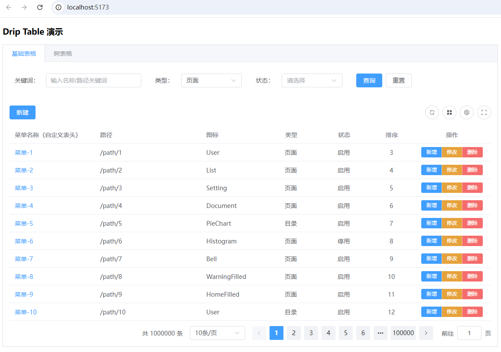
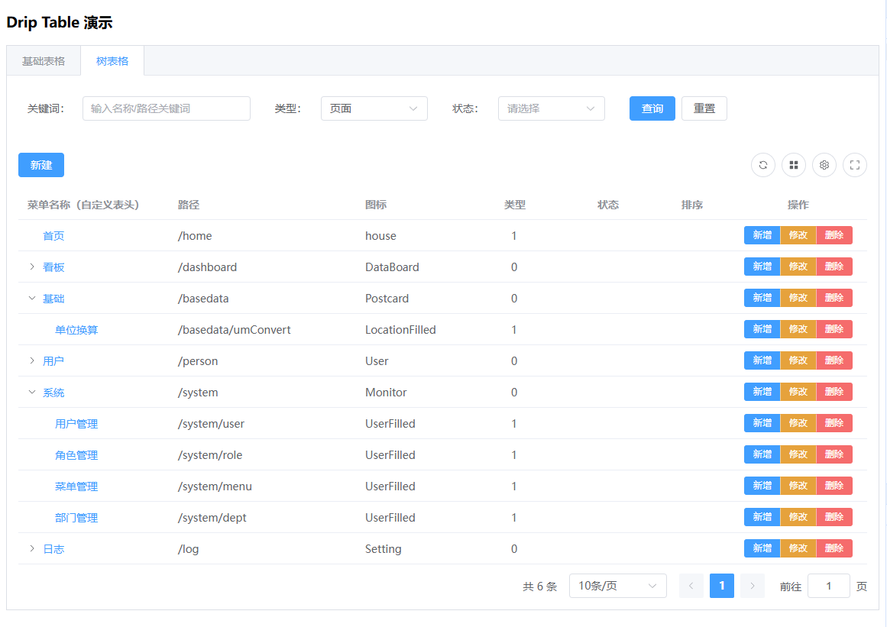

# 安装

基于element-plus的组件二次封装的表格组件, 依赖于element-plus的组件, 请先安装好element-plus的组件库, 再使用.

```shell
pnpm add vue element-plus @element-plus/icons-vue @dripadmin/drip-table
```

# 使用demo参考
github目录下playgrounds/drip-table-demo文件夹
github: https://github.com/dripadmin/drip-table
- 表格组件demo

- 树表格组件demo



# 引入与注册

```
import { createApp } from 'vue';
import ElementPlus from 'element-plus';
import { DripTable, DripForm } from '@dripadmin/drip-table';

const app = createApp(App);
app.use(ElementPlus);
app.use(DripTable, { locale: 'zh-cn' });
app.use(DripForm);
app.mount('#app');
```

# 组件使用

```
<DripTable :columns="columns" :data="rows" />
<DripForm :config="{ items: [{ type: 'input', label: '关键词', field: 'keyword' }] }" />
```

# 配置项说明

## DripTable属性

- columns: DripTableColumn[]  表格列定义数组。每个列对象支持以下字段：
  - label: 列头显示的文本（必填）
  - prop: 对应数据字段名（可选；当使用自定义插槽时可省略）
  - type: 特殊列类型（'selection' 勾选列、'index' 序号列、'expand' 展开列）
  - width/minWidth: 列宽/最小列宽（number | string）
  - fixed: 固定列（true | 'left' | 'right'）
  - sortable: 是否可排序（boolean | 'custom'）
  - align/headerAlign: 单元格/表头对齐方式（'left' | 'center' | 'right'）
  - showOverflowTooltip: 内容溢出时是否展示 Tooltip（boolean）
  - slot: 单元格内容插槽名（用于自定义渲染）
  - headerSlot: 表头插槽名（用于自定义表头渲染）
  - children: 子列（用于多级表头，数组形式）

- data: any[]
  - 表格数据源数组。

- loading: boolean
  - 是否显示加载状态。

- loadingText: string
  - 加载中文案。

- pagination: DripTablePagination   分页配置对象，字段如下：
  - total: 总条数（必填）
  - pageSize: 每页条数（必填）
  - currentPage: 当前页码（必填）
  - layout: 分页布局字符串（例如 'total, sizes, prev, pager, next, jumper'）
  - pageSizes: 可选的 pageSize 列表（如 [10, 20, 50]）
  - size: 分页尺寸（'small' | 'default' | 'large'）
  - background: 是否带背景（boolean）
  - align: 对齐方式（'left' | 'center' | 'right'）
  - style: 内联样式对象（CSSProperties）
  - class: 额外类名（string）
  - disabled: 是否禁用（boolean）
  - hideOnSinglePage: 只有一页时是否隐藏（boolean）

- locale: string | Language 国际化语言或对象；安装时也可在 app.use(DripTable, { locale }) 传入。

- rowHoverBgColor: string
  - 鼠标悬浮行的背景色（例如 '#f5f7fa'）。

- tableKey: string | number
  - 用于强制刷新表格的 key。

- showOverflowTooltip: boolean
  - 是否为整表开启溢出 Tooltip（列级别可单独控制）。

- elTableProps: Record<string, any>
  - 透传给 Element Plus ElTable 的原生属性（如 border、stripe、size 等）。

- toolbar / toolbarLeft / toolbarRight: DripTableToolbarConfig 工具条配置对象。toolbarLeft/toolbarRight 分别控制左右区域；toolbar 为兼容字段（建议使用左右分栏）。支持字段如下：
  - showPrimaryAction: 是否显示左侧“主操作”文本按钮（默认关闭）
  - primaryActionText: 主操作按钮文本（如“新建”）
  - primaryActionType: 主操作按钮类型（'primary' | 'success' | 'warning' | 'danger' | 'info' | 'default'）
  - onPrimaryAction: 点击主操作的回调函数
  - buttonSize: 工具条按钮尺寸（'small' | 'default' | 'large'）
  - gap: 按钮间距（px）
  - class/style: 额外类名与内联样式
  - showPrint: 是否显示打印按钮
  - showExport: 是否显示导出 CSV 按钮
  - showRefresh: 是否显示刷新按钮
  - showSize: 是否显示表格密度（大小）选择
  - sizeOptions: 可选密度列表（['small','default','large'] 的子集）
  - showColumnSetting: 是否显示列设置（可见性/顺序）
  - showFullscreen: 是否显示“最大化”按钮（区域最大化）
  - fullscreenHideUI: 进入最大化时是否隐藏非表格 UI（true/false）
  - exportFileName: 导出文件名（不含扩展名）
  - printAreaId: 打印区域的 DOM id
  - onRefresh: 刷新按钮回调（存在时优先生效）
  - fullscreenTargetId: 需要最大化的容器 DOM id

## DripForm 配置

- DripFormConfig（整体表单样式与行为）
  - inline: 是否行内表单（boolean）
  - labelPosition: 标签位置（'left' | 'right' | 'top'）
  - labelWidth: 标签宽度（number | string）
  - labelSuffix: 标签后缀（如冒号 '：'）
  - size: 表单控件尺寸（'small' | 'default' | 'large'）
  - style: 表单容器内联样式（Record<string, any>）
  - items: 表单项数组（必填，见 DripFormItem）
  - submitText: 提交按钮文案（默认“查询”或“提交”）
  - resetText: 重置按钮文案（默认“重置”）
  - onSubmit: 点击提交时回调 (values)
  - onReset: 点击重置时回调 (values)

- DripFormItem（单个表单项）
  - type: 控件类型（'input' | 'select' | 'checkbox' | 'radio' | 'date' | 'daterange'）
  - label: 标签文本
  - field: 绑定字段名（提交时的键）
  - placeholder: 占位提示
  - options: 选项数组（用于 select/checkbox/radio；结构 { label, value }）
  - clearable: 是否可清空（boolean）
  - width: 控件宽度（number | string）


# tag
```
git tag -a v0.2.13 -m "release v0.2.13"
git push origin v0.2.13
```