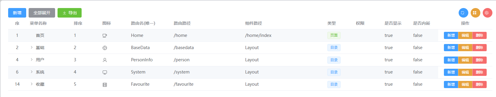
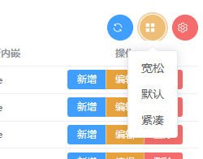

> 文档更新或许有延迟,可以参考demo例子, 通常都会在案例测试通过后,发布新版本.

> 2025.10.25: 今天正式完成了第一个完整版本的优化, 添加了使用说明,值得纪念的日子.
# 1. 安装

基于element-plus的el-table组件二次封装的表格组件, 依赖于element-plus的组件, 请先安装好element-plus的组件库, 再使用.

```shell
pnpm add vue element-plus @element-plus/icons-vue @dripadmin/drip-table
```

# 2. demo演示
demo案例存放在github目录下playgrounds/drip-table-demo文件夹
github: https://github.com/dripadmin/drip-table
- 表格组件demo

- 树表格组件demo


# 3. 引入与注册

在main.ts中引入样式

```typescript
// 引入 DripTable/DripForm 的样式
import "@dripadmin/drip-table/style.css";
```

在使用表格的地方引入

```typescript
import { DripTable, DripForm } from "@dripadmin/drip-table";
```

##  3.1 普通表格使用

案例参考git目录playgrounds/drip-table-demo/src/components/TableDemo.vue
```vue
    <DripTable
      :columns="columns"
      :data="pagedRows"
      :pagination="pagination"
      :toolbar-left="tableToolbarLeft"
      :toolbar-right="tableToolbarRight"
      :row-toolbar="tableRowToolbar"
      @page-change="onPageChange"
      @row-action="onRowAction"
      @table-action="onTableAction"
    >
      <template #titleCell="{ row }">
        <span style="color: var(--el-color-primary)">{{ row.title }}</span>
      </template>
      <template #titleHeader>
        <span>菜单名称（自定义表头）</span>
      </template>
    </DripTable>
```
## 3.2 树表格使用
案例参考git目录playgrounds/drip-table-demo/src/components/TreeTableDemo.vue
```vue
    <DripTable
      :row-key="(row: any) => row.id"
      :tree-props="{ children: 'children' }"
      :columns="columns"
      :data="treeData"
      :pagination="pagination"
      :toolbar-left="tableToolbarLeft"
      :toolbar-right="tableToolbarRight"
      :row-toolbar="tableRowToolbar"
      :default-expand-all="defaultExpandAll"
      @page-change="onPageChange"
      @table-action="onTableAction"
      @row-action="onRowAction"
    >
      <template #titleCell="{ row }">
        <span style="color: var(--el-color-primary)">{{ row.title }}</span>
      </template>
      <template #titleHeader>
        <span>菜单名称（自定义表头）</span>
      </template>
    </DripTable>
```
# 4.配置项说明

## 4.1 DripTable属性
```
- columns: DripTableColumn[]  表格列字段定义数组。参考DripTableColumn属性
- data: any[]  表格数据数组
- enable-page: boolean  是否启用分页, 默认为true,开启
- pagination: DripTablePagination  分页的属性, 参考DripTablePagination属性
- toolbar-left: DripTableToolbarConfig  表格左侧工具条, 参考DripTableToolbarConfig属性
- toolbar-right: DripTableToolbarConfig  表格右侧工具条, 参考DripTableToolbarConfig属性
- row-toolbar: DripTableRowToolBar  表格行级工具条,参考DripTableRowToolBar属性
- default-expand-all: boolean  当为tree表格时,是否默认展开所有树节点
- row-key: (row: any) => any  行数据的唯一键函数
- tree-props: { children: string, hasChildren: string }  tree表格时,自定义相关属性对象
```
## 4.2 DripTable事件
```
- page-change: (size: number, currentPage: number) => void | undefined  分页页码改变时触发的事件,第一个参数为每页显示条数,第二个参数为当前页码
- row-action: (eventName: string, row: any) => void | undefined  表格行操作按钮点击时触发的事件, 第一个参数为操作按钮的事件名, 第二个参数为当前行数据
- table-action: (eventName: string, data?: any, config?: any) => void | undefined  表格工具条按钮点击时触发的事件, 第一个参数为操作按钮的事件名, 第二个参数为自定义数据的回传, 第三个参数为自定义配置的回传
```
### 4.2.1 page-change事件
通常会在分页属性变化时, 重新加载下数据:
```typescript
async function loadData() {
  const res: Page<any> = await getLoginlogPageApi(pageQueryParams.value);
  rows.value = res.records;
  pagination.value.total = res.total;
}

function onPageChange(size: number, currentPage:number) {
  pagination.value.pageSize = size;
  pagination.value.currentPage = currentPage;
  loadData();
}
```
### 4.2.2 row-action 事件
行级操作, 通过可用于修改行,删除行等操作, 行级操作时,会接收到该行的所有字段值.

案例如下:

```typescript
// 处理表格行操作
function onRowAction(action: string, row?: any) {
  // 编辑
  if (action === "edit") {
    getMenuByIdApi(row.id).then((res: any) => {
      rowData.value = { ...res };
      if (rowData.value && rowData.value.id) {
        editFormRef.value?.open("edit", rowData.value);
      } else {
        ElMessage.error("获取详情失败");
      }
    });
  }

  // 添加
  else if (action === "add") {
    editFormRef.value?.open("add");
  }

  // 删除
  else if (action === "delete") {
    ElMessageBox.confirm("确认删除角色吗？", "删除", {
      confirmButtonText: "确定",
      cancelButtonText: "取消",
      type: "warning",
    }).then(() => {
      deleteMenuByIdApi(row.id).then(() => {
        ElMessage.success("删除成功");
        userStore.reloadMenus();
        loadData();
      });
    });
  }
}
```
### 4.2.3 table-action事件
表格工具栏事件, 通常可用于刷新, 打印, 导出等操作.
如果表格添加了右侧工具栏, 内置了刷新, 行间距调整, 列设置按钮, 只有刷新事件暴露出来了, 需要自己处理.
自定义的按钮事件,会在default中看到事件名和参数信息, 根据实际配置,通过case完成对事件的处理.
如何定义工具栏定义.
```typescript
//处理表格工具栏事件
function onTableAction(eventName: string, data?: any, config?: any) {
  switch (eventName) {
    case 'refresh':
      loadData();
      break;
    case 'expandAll':
      expandAll.value = true;
      loadData();
      break;
    case 'add':  
      editFormRef.value?.open("add");
      break;
    default:
      console.log('点击主操作', eventName, data, config);
  }
}
```

## 4.3 DripTablePagination 分页属性
表格默认开启分页, **尽管表格默认开启了分页,但是依然需要传递该属性给表格**, 包含总记录数,当前页码和每页显示多少记录数.
```
- current-page: number  当前页码, 默认为1
- page-size: number  每页显示条数, 默认为10
- total:number 总记录数
- size:"small" | "default" | "large";  分页栏大小
- align: "left" | "center" | "right";  分页位置
```

定义初始化属性:

```
// 数据与分页
const pagination = ref<DripTablePagination>({
  pageSize: 10,
  currentPage: 1,
});
```

作为分页查询时,使用该分页属性

```
//分页查询参数（包含当前页、每页数量和表单数据）
const pageQueryParams = computed(() => ({
  currentPage: pagination.value.currentPage,
  pageSize: pagination.value.pageSize,
}));
```

在开始加载表格数据中, 需要给分页属性添加总记录数

```
async function loadData() {
  const res: Page<any> = await getRolePageApi(pageQueryParams.value);
  rows.value = res.records;
  pagination.value.total = res.total;
}
```

在执行分页上的按钮操作和刷新时, 需要修改分页属性,并重新加载数据

```
// 分页切换
function onPageChange(size: number, currentPage: number) {
  pagination.value.currentPage = currentPage;
  pagination.value.pageSize = size;
  loadData();
}

// 刷新
function onRefresh() {
  pagination.value.currentPage = 1;
  loadData();
}
```

所以使用到的地方还挺多的.


## 4.4 DripTableColumn表格字段属性

columns: DripTableColumn[]  表格列定义数组。

每个列对象支持以下[普通属性]定义：

```vue

  - prop: string  列数据的字段名
  - label: string  列标题
  - width: string | number  列宽度
  - minWidth:string | number  列最小宽度
  - align: string  列对齐方式（'left', 'center', 'right'）
  - slot:string  表格内容自定义槽名称
  - headerSlot:string 表格标题自定义槽名称
```

[特殊属性]定义

index:  用于表格中序号的定义

```
 - type: "selection" | "index" | "expand"; 普通列不需要定义该字段
```

案例,以下是一个完整的菜单的列定义

```typescript
// 列定义
const columns = ref<DripTableColumn[]>([
  { type: "index", label: "序", width: 60, align: "center" },
  { label: "菜单名称", prop: "title", minWidth: 120 },
  { label: "排序", prop: "sort" },
  { label: "图标", prop: "icon",minWidth: 80, slot:'iconSlot'},
  { label: "路由名(唯一)", prop: "name", minWidth:120 },
  { label: "路由路径", prop: "path",minWidth: 200},
  { label: "组件路径", prop: "component",minWidth: 230},
  { label: "类型", prop: "type",slot:"typeSlot"},
  { label: "权限", prop: "perms"},
  { label: "是否显示", prop: "visible"},
  { label: "是否内嵌", prop: "isFrame"},
]);
```
在图标和类型字段中,这里使用了自定义的槽slot,用于自定义显示内容,在表格中使用slot如下:
```vue
 <DripTable
   ... ....
  >
    <template #iconSlot="{ row }">
       <component :is="row.icon" style="width:16px;" />
    </template>
    <template #typeSlot="{ row }">
      <el-tag :type="menuTypeMap[row.type]?.type || 'primary'" effect="light">
        {{ menuTypeMap[row.type]?.label || '-' }}
      </el-tag>
    </template>
  </DripTable>
```


## 4.5 DripTableToolbarConfig 表格工具栏属性
表格级工具栏分为表格的左右两边工具栏,两边工具栏属性一致
只不过在表格右工具栏中预定义了刷新,行间距,列设置操作.

```vue
- size?: 'small' | 'default' | 'large'  工具条大小
- gap?: number  工具条按钮间距
- class?: string  自定义类名
- style?: CSSProperties 自定义样式
- group?: boolean 自定义是否分组显示
- btnStyle?: 'circle' | 'round' | 'link' | 'text' | 'plain' | ''  自定义按钮样式
- showTooltip?: boolean  是否显示按钮提示
- showIcon?: boolean  是否显示按钮图标
- showText?: boolean  是否显示按钮文本
- actions?: DripButton[] 自定义操作按钮数组
- columns?: DripTableColumn[];  用于列设置时的字段内容,需要传入表格的columns的值
```

### 4.5.1 DripButton属性
```vue
- label: string  按钮文本
- type?: 'primary' | 'success' | 'warning' | 'danger' | 'info' | 'default';  按钮类型
- disabled?: boolean;  是否禁用
- event: string  按钮点击事件名
- icon?: string;  按钮图标
- link?: boolean;  是否为链接按钮
- data?: any;  自定义数据
- config?: any;  自定义配置
```

实际案例, 由于已经在组件中预设置了工具栏的部分属性,所以使用起来更简单:
```typescript
// 左边工具条
const toolbarLeft = ref<DripTableToolbarConfig>({
  actions: [
    { label: "新增", type: "primary", event: "add" },
    { label: "全部展开", type: "info", event: "expandAll" },
    { label: "导出", type:"success",icon:"download",event: "export",config:{fileName:'菜单报表'} }
  ]
});
```


如果添加导出功能,并且导出报表的文件名需要定义,可以通过data属性传递文件名,也可以通过config属性传递文件名.
如果是data属性,即是下面这样定义的:

```
{ label: "导出", type: "info", event: "export",data:{fileName:'菜单报表'} }
或
{ label: "导出", type: "info", event: "export",data:'菜单报表'}
```
在处理定义事件时,通过下面的方法,可以获取到data或者config的值
然后在case中定义处理每个事件的方法即可.
```typescript
//处理表格工具栏事件
function onTableAction(eventName: string, data?: any, config?: any) {
  switch (eventName) {
    case 'refresh':
      loadData();
      break;
    case 'add':  
      editFormRef.value?.open("add");
      break;
    default:
      console.log('点击主操作', eventName, data, config);
  }
}
```
右边工具条由于默认已经提供3个操作,所以只需要提供列设置的columns值即可
```typescript
//右边
const toolbarRight = ref<DripTableToolbarConfig>({
  columns: columns.value
});
```

当为treeTable时,会自动处理展开全部,折叠全部事件.
只需要在toolbar中定义事件名称即可,表格会自动根据event值来判断.
这里的event值只能是expandAll或者collapseAll.
```typescript
{ label: "全部展开", type: "info", event: "expandAll" },
{ label: "全部折叠", type: "info", event: "collapseAll" },
```

## 4.6 DripTableRowToolBar 表格行工具栏(操作列)属性
```vue
- label?: string;  工具栏文本
- width?: number | string;  工具栏宽度
- align?: Align;  工具栏对齐方式
- fixed?: boolean | "left" | "right";  工具栏是否固定在左侧或右侧
- size?: "small" | "default" | "large";  工具栏大小
- group?: boolean;  是否分组显示
- actions: DripButton[];  自定义操作按钮数组
```
使用参考案例:
```typescript
const rowToolbar = ref<DripTableRowToolBar>({
  actions: [
    { label: "新增", type: "primary", event: "add" },
    { label: "编辑", type: "warning", event: "edit" },
    { label: "删除", type: "danger", event: "delete" },
  ],
});
```


#### 备忘录
Git 贡献提交规范
参考 vue 规范 (Angular)
```
- `feat` 增加新功能
- `fix` 修复问题/BUG
- `style` 代码风格相关无影响运行结果的
- `perf` 优化/性能提升
- `refactor` 重构
- `revert` 撤销修改
- `test` 测试相关
- `docs` 文档/注释
- `chore` 依赖更新/脚手架配置修改等
- `workflow` 工作流改进
- `ci` 持续集成
- `types` 类型定义文件更改
- `wip` 开发中
```

推送tag标签规范
```
- 创建标签（指向当前提交）：
git tag -a v0.2.13 -m "release v0.2.13"
- 推送到远程：
git push origin v0.2.13
或推送所有本地标签：
git push --tags
```